# 📢 Upcoming Documentation: Wearable-LED-Light-Show-Shirt

✨ I haven’t uploaded the full **Project Demo** for this one yet — because it’s something truly exciting!

For those reviewing my work from a **resume perspective**, I’ve uploaded a **demo video** showcasing the **LED-Music-Visualiser** in action.

---

## 👋 Dear Friends and Well-Wishers

I’ve been preparing detailed **README documentation** for my three projects.  
So far, I’ve completed the documentation for the **RC-Warship Project** 🚢.

---

## 📂 Project Release Plan (Next 2–3 Weeks)

1️⃣ **RC Warship** – ✅ Completed  
2️⃣ **LED Music Visualizer** – ✅ Completed  
3️⃣ **Wearable LED Light Show Shirt** –  🔜 Coming soon 

---

## 🎯 Final Note

I truly believe these projects will **surprise the audience** — so I’ll keep the **big reveal** for the day I share it on **LinkedIn**.  

👉 Stay tuned! 🚀

# LED Shirt Editor

## 🎶 Why I Built the LED Shirt Editor

Watching light shows and LED performances, I always wondered:  
*Are the LEDs really “dancing” to the music, or is there someone behind the scenes carefully programming every moment?*  
That question stayed with me.

After building my own LED Music Visualizer, I realized that most existing solutions are either:

- **Too basic** – Simple, microphone-based sound-to-light systems that just flash with volume.  
- **Too rigid** – Pre-programmed shows with little room for creativity on the user’s side.

The goal wasn’t just technical — it was about **creative freedom**.  
I wanted to build a system where anyone — whether a performer, hobbyist, or artist — could make LEDs dance to music exactly the way they imagine.

That’s how the **LED Shirt Editor** was born. ✨

---

## 🛠️ What This Project Includes

This project is a **complete solution**, consisting of:

1. **Python FastAPI Backend** – Processes music and timeline data.  
2. **Frontend Webpage** – Lets you visually design light shows with an intuitive timeline editor.  
3. **ESP32 Clients** – Execute the commands on the wearable LED shirts in real-time.  

---

## 🎥 Demo

Here’s a quick look at the system in action:

---

## 🚀 What It Does

In short, it transforms LED performances from being **“automated and hidden”** into something **user-driven, programmable, and interactive**.  

Instead of hardcoding effects, you can directly interact with the **frontend timeline** to design LED light events — making the process as intuitive as editing a video.

---

## 🏗️ Architecture Behind It

The project follows a **client–server model**, where the **laptop (server)** does all the heavy processing (music analysis, timeline editing, effect generation) and the **ESP32 boards (clients)** only execute LED instructions.

---

### 🔹 Components

1. **Frontend Webpage (Timeline Editor)**  
   - Lets users import a song.  
   - Displays a waveform/timeline (with beat detection).  
   - Allows placing LED events (colors, brightness, effects) in sync with the song.  
   - Exports the design as a JSON blueprint.  

2. **Python Backend Server (FastAPI + WebSockets)**  
   - Handles uploaded audio (`.wav`) + LED timeline (`.json`).  
   - Analyzes music (frequency/amplitude) to make patterns.  
   - Generates LED configuration arrays for each time chunk.  
   - Streams real-time LED data to ESP32 clients while music plays.  

3. **ESP32 Clients (LED Drivers)**  
   - Connect to Wi-Fi and listen to the server.  
   - Receive per-frame LED color data via WebSockets.  
   - Directly control WS2812B LED strips without heavy computation.  

---

### 🔹 System Workflow (Step by Step)

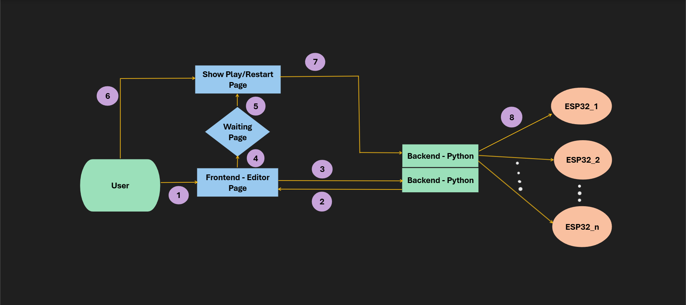

#### **Step 1 → User → Frontend (Editor Page)**
- User uploads a `.wav` music file.  
- Configures LED timelines (color, brightness, effects, ESP32 target).  
- Timeline UI provides play/pause/zoom/snapping controls.  

#### **Step 2 → Backend (Python) → Frontend (Editor Page)**
- Backend performs music analysis (FFT, beat detection) after preview request.  
- Generates preview LED data arrays for synchronization.  
- User continues editing after previewing.  

#### **Step 3 → Frontend (Editor Page) ↔ Backend (Python)**
- Frontend sends project data (timeline JSON + audio file) to backend.  
- Backend validates and stores configuration.  

#### **Step 4 → Frontend (Editor Page) → Waiting Page**
- Once editing is done, frontend submits final project for processing.  
- User is shown a **Waiting Page** while backend prepares LED arrays.  

#### **Step 5 → Waiting Page → Show Play/Restart Page**
- When backend finishes pre-computation, frontend switches to **Play/Restart Page**.  
- User is notified that playback is ready.  

#### **Step 6 → User → Show Play/Restart Page**
- User triggers Play or Restart.  
- Frontend sends control command to backend.  

#### **Step 7 → Show Play/Restart Page → Backend (Python)**
- Backend synchronizes audio playback with LED configuration streaming.  
- Handles play, pause, restart, and sync logic.  
- Streams LED frame data in real-time to ESP32 clients.  

#### **Step 8 → Backend (Python) → ESP32 Clients**
- Backend pushes per-frame LED data (RGB + brightness) via WebSockets.  
- ESP32s immediately render LEDs as instructed.  
- Continues until song ends or user stops playback.  

---

### 🔹 Simplified Data Flow

1. User loads a song in the webpage and designs the LED timeline.  
2. The blueprint JSON is sent to the Python backend.  
3. Backend processes audio + blueprint → generates LED frames.  
4. During playback, backend streams LED frames to all ESP32 clients in sync with the music.  
5. ESP32s simply display the incoming LED data.  

---

### 🔹 Why This Architecture?

- Keeps **ESP32 code lightweight** (only display logic).  
- Heavy tasks (audio analysis, timeline rendering, JSON parsing) stay on the **laptop**.  
- **Modular design** → Add more ESP32 devices without changing the core system.  
- **WebSockets** ensure real-time synchronization across devices.  

## 🌐 A Closer Look at the Frontend Webpage

### 🖋️ Signature Header & Device Monitor

- **"Anu Woow !!!" (Animated Title)**  
  A decorative, glowing text at the top that acts as a brand and personal signature for the editor.  
  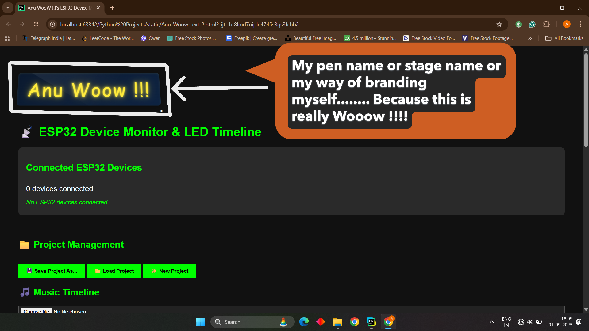

- **Connected ESP32 Devices List**  
  Displays the ID and IP address of each connected ESP32 client.  
  Updates in real-time via WebSockets so you can instantly see which devices are active and available for programming and previewing.  
  

---

### 📁 Project Management Controls

- **Save Project As…** → Saves the current timeline as a JSON file for later editing.  
- **Load Project** → Imports a previously saved project back into the editor.  
- **New Project** → Clears everything to start with a blank timeline.  

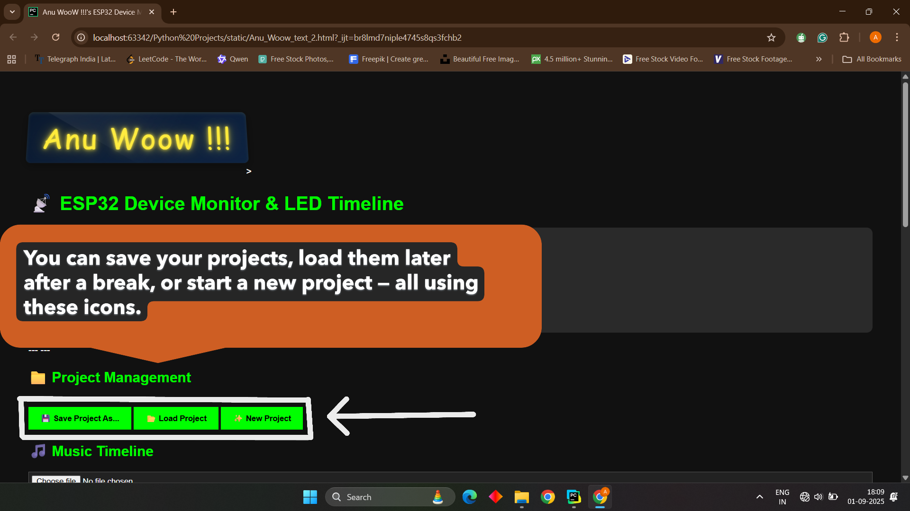

---

### 🎵 Music Timeline & Playback

- **File Upload (WAV only)** → The first step in creating a project is importing a WAV audio file.  
- **Waveform Display** → Powered by *WaveSurfer.js*, gives a precise view of the music for aligning markers.  
- **Playback Controls** → Play/Pause button with a Current Time / Total Duration display for precise editing.  

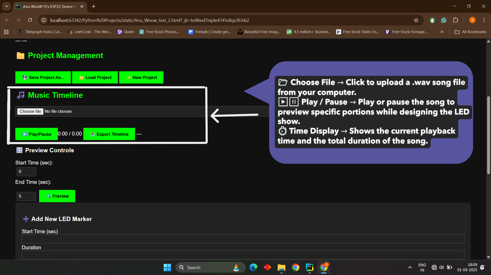  

- **Export Timeline** → Uploads the entire timeline and audio to the backend server to begin the processing stage.  

| Export Timeline (PNG) | Export Timeline Demo (GIF) |
|------------------------|----------------------------|
| 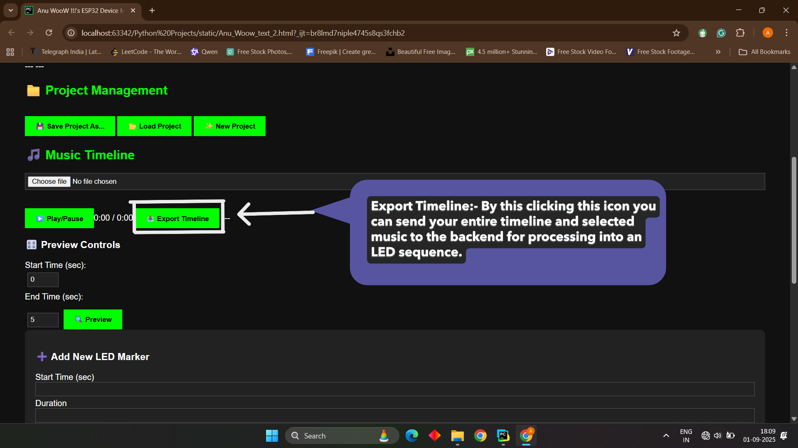 | 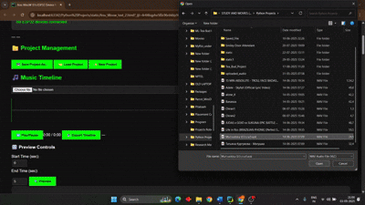  |

### ➕ Adding a New LED Marker

The core creative tool for defining lighting events on the timeline.  
After filling out the form, click **Add Marker** to place the effect.

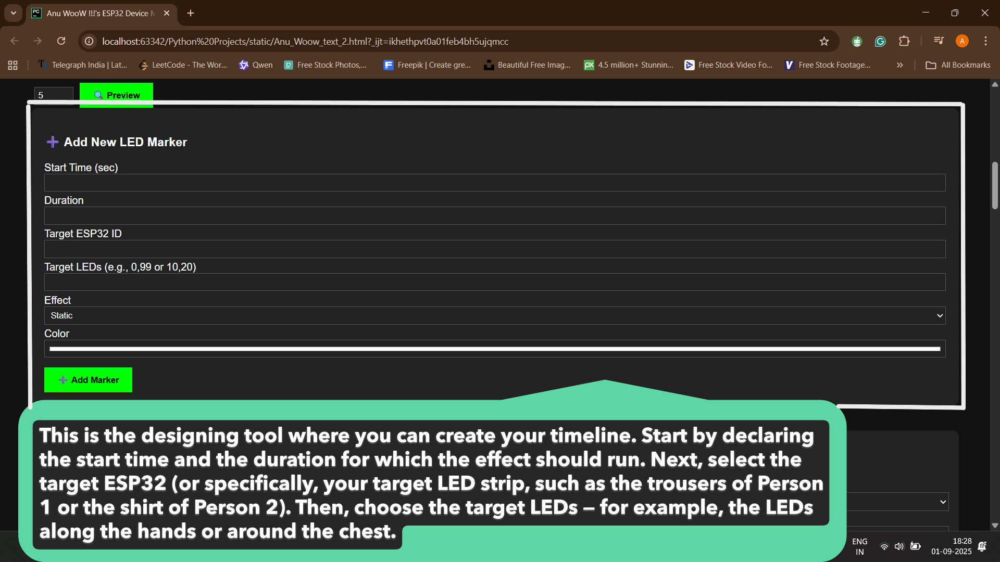  

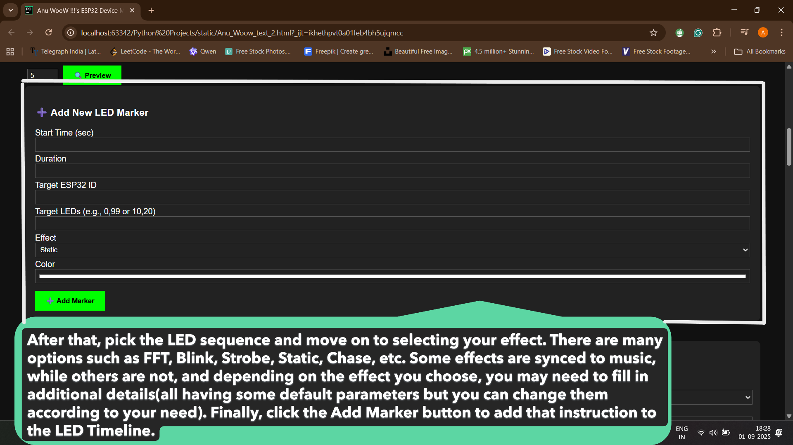

---
## 🎥 Demo

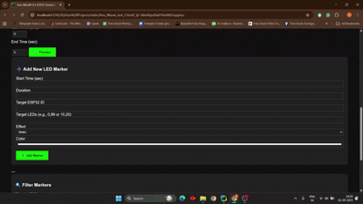

---
- **Timeline Settings** → Define the *Start Time* and *Duration* of the effect.  
- **Device & LED Range** → Select the *Target ESP32 ID* and LED range (e.g., `0,99` for the first 100 LEDs). Recent selections are saved to reduce typing.  
- **Effect & Parameters** → Choose an effect (Static, FFT, Blink, Rainbow, Chase, Sparkle, Strobe, Comet, Fire).  
  - Dynamic input fields appear to fine-tune parameters like color, speed, or density.  

---

### 🔍 Timeline Overview & Editing

- **LED Timeline Markers List**  
  Scrollable list displaying all added markers.  
  Each marker shows key details and includes a **Delete Button** for easy removal.  

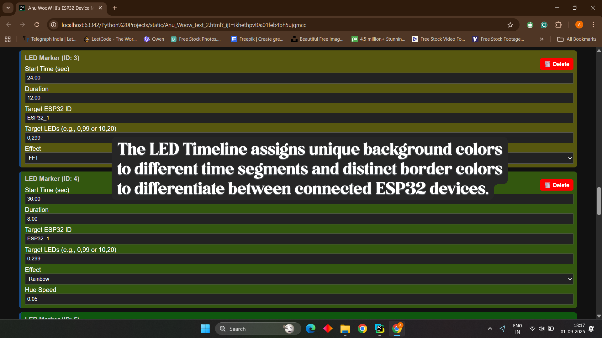  

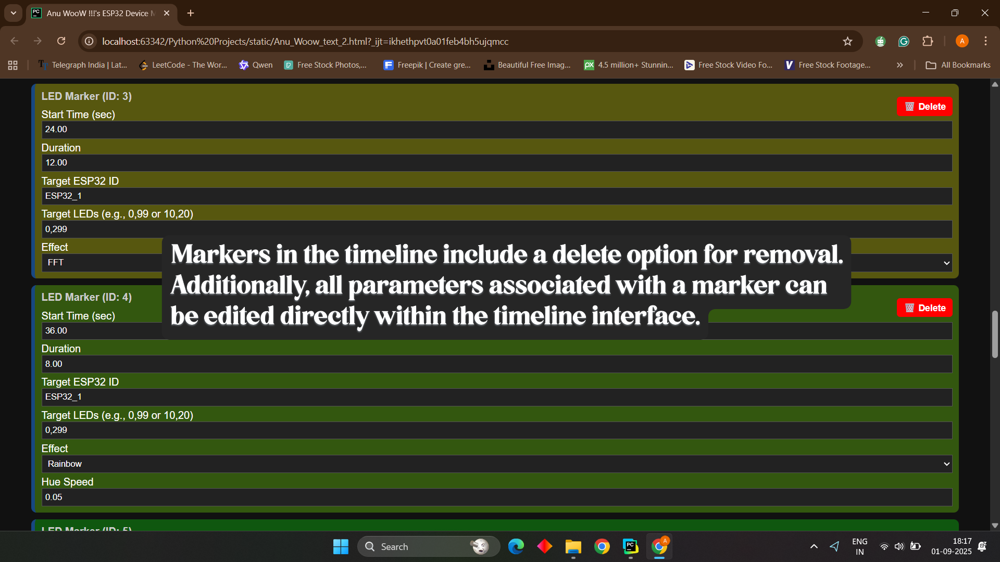

- **Filters**  
  Manage large projects by filtering markers by ESP32 device or by time range.  
  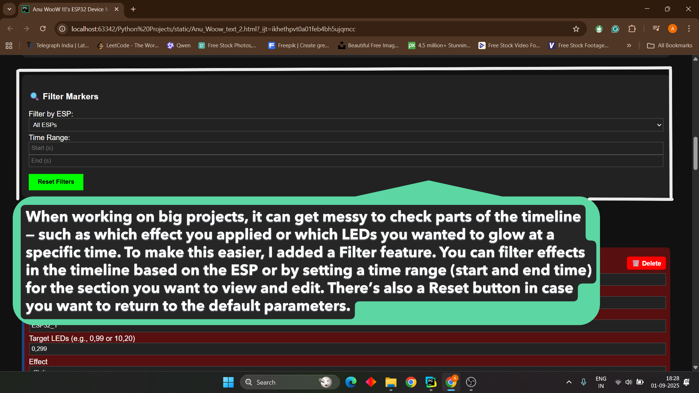

- **Preview Section**  
  Test a small segment of the music by entering a *Start Time* and *End Time*.  
  The Preview Button sends only that section to the backend for quick test playback.  

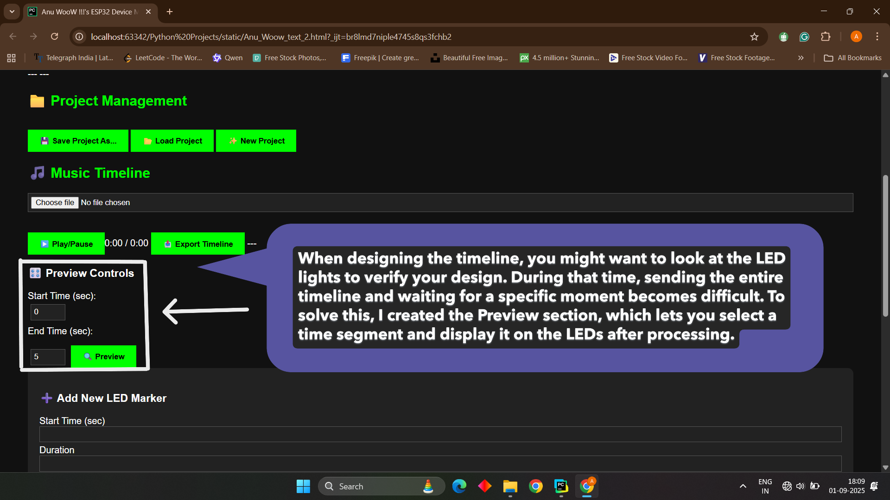

---

## 🖥️ A Deep Dive into the Backend Python Server

The backend server is the **brain** of the LED Shirt Editor system.  
Written in **Python with FastAPI**, it handles all heavy-lifting tasks that the lightweight ESP32 clients can’t.

**Core Responsibilities:**
- Handling audio and timeline uploads from the frontend.  
- Analyzing music (FFT, energy, Zero Crossing Rate, etc.) and generating LED effect sequences.  
- Managing real-time communication with ESP32 LED clients via WebSockets.  
- Synchronizing music playback with LED data streaming so lights stay perfectly in time with the audio.  

## ⚙️ Architecture

The server has four main responsibilities:

### 1. Project Upload and Processing
- Users upload a `.wav` file and an LED timeline configuration from the frontend.  
- The server saves the files, analyzes the audio in chunks, and generates JSON sequences that describe the LED effects.  

### 2. Effect Generation
- Each supported effect (`STATIC`, `BLINK`, `SPARKLE`, `COMET`, `RAINBOW`, `CHASE`, `STROBE`, `FIRE`, `FFT`) has its own sequence generator function.  
- These functions transform music features (energy, frequency, zero-crossing rate) into LED control instructions.  

**Examples:**  
- **FFT** → Maps bass/mid/treble energy into RGB values.  
- **SPARKLE** → Creates random LED fades, with intensity based on music energy and zero-crossing rate.  
- **COMET** → Generates moving light trails, with number and size determined by music speed.  

### 3. Playback and Preview
- **Full Playback (`/start-playback`)** → Plays the entire audio file while streaming the full LED data sequence.  
- **Preview Mode (`/start-preview`)** → Plays only a trimmed section of the audio and timeline for quick testing.  

### 4. ESP32 Communication
- ESP32 clients connect via the **`/ws/esp32`** endpoint, each identified by a unique `device_id`.  
- The server sends per-chunk LED instructions as JSON packets via WebSockets during playback.  
- Dashboards (frontends) can also connect to a separate **`/ws/dashboard`** endpoint to monitor connected ESP32 devices in real-time.  
- A **heartbeat system** automatically removes disconnected ESP32s from the active list.  

---

### 🔌 Key Code Components

- **FastAPI + WebSockets** → Core frameworks for API + real-time LED streaming.  
- **`ConnectionManager`** → Class that tracks all connected ESP32 devices & dashboards and manages broadcasting updates.  
- **`get_all_sequences()`** → Central function that generates all LED sequences based on the uploaded audio and timeline.  
- **Effect Generators** → Functions like `generate_fft_sequence()` and `generate_sparkle_sequence()` produce the effect data.  
- **Audio Streaming (`sounddevice`)** → Library used to play audio on the server while sending LED data in sync.  

---

### 📂 Files and Outputs

- **Uploaded Audio** → `uploaded_audio/uploaded.wav`  
- **Timeline Config** → `led_timeline.json`  
- **Precomputed Sequences** → `all_sequences.json`  
- **ESP32 Commands** → Sent live as WebSocket JSON messages  

---

## ⚡ A Deep Dive into the ESP32 Client

The **ESP32** is a low-power microcontroller with built-in Wi-Fi, making it the perfect choice for this project.  
Its job is to act as a **lightweight LED executor** that smoothly displays the effects defined in the editor.  

### Role & Communication
- The ESP32 does **not** perform heavy processing.  
- It maintains a WebSocket connection to the Python server and listens for real-time LED instructions.  
- The server streams per-frame LED data, and the ESP32 parses packets and updates LEDs immediately.  

### Key Features
- **Non-blocking design** → Uses `millis()`-based loops instead of delays, so it can handle Wi-Fi + LED updates simultaneously.  
- **Configurable Effects** → Supports Static, Blink, Sparkle, Comet, etc., with parameters for duration, color, brightness, and LED ranges.  
- **Smooth Transitions** → Can run multiple effects simultaneously on different LED segments and transition smoothly across timeline events.  

### Packet Handling
- Each JSON packet defines a command for the ESP32.  
- Includes **target LED range, effect type, color/brightness values, and effect-specific parameters** (e.g., speed, fade).  
- ESP32 decodes the packet and applies the effect immediately.  

### Scalability
- Each ESP32 only processes its **assigned LED ranges**.  
- Multiple ESP32s can run simultaneously on the same Wi-Fi network.  
- Enables **large synchronized light shows** across multiple wearables.  

### Why ESP32?
- **Built-in Wi-Fi** → Seamless WebSocket communication.  
- **Timing-sensitive control** → Strong enough to drive WS2812B LEDs with precise timing.  
- **Power + Cost Efficiency** → Low-cost, low-power, but still powerful for smooth animations.  

---

## 🛠️ Problems and Challenges Faced in Each Section

When I started this project during my **B.Tech in Electronics and Communications**, my programming background was limited:  
- C (1st year), Java (3rd semester), but little knowledge of **HTML, CSS, JavaScript**.  
- **Python was completely new** — I learned it through this project.  

### Main Challenges
- **Learning New Languages & Tools** → Lots of trial-and-error, relying on AI tools (ChatGPT, Gemini) for help.  
- **Real-time Synchronization** → Initially LEDs didn’t sync with beats at all; fixing this took multiple iterations.  
- **Dividing Processing** → Designing so the backend does heavy work and ESP32 only executes. Balancing was tricky.  
- **Webpage Design & UI** → Deciding layout, controls, input handling, and visual design was challenging as a beginner.  
- **Bridging Hardware + Software** → Learning how software inputs control hardware outputs was a major step.  
- **System Architecture** → Took multiple revisions before finalizing reliable frontend–backend–ESP32 communication.  

---

## 🚀 How Powerful This System Is

This system is designed with **scalability and flexibility** at its core.  

- **Supports Multiple ESP32s** → Theoretically up to 100 at once, each driving its own LED strip.  
- **Per-LED Control** → Every LED is individually programmable. You can define exact behavior for every moment.  
- **Modular Architecture** → Easily extendable with new effects without changing the core system.  
- **Creative Freedom** → From subtle fades to complex professional-grade light shows, you control every detail.  

This flexibility allows use across:  
- Wearable fashion (shirts, trousers, hats)  
- Stage performances  
- Room-scale or prop-based synchronized light shows  

