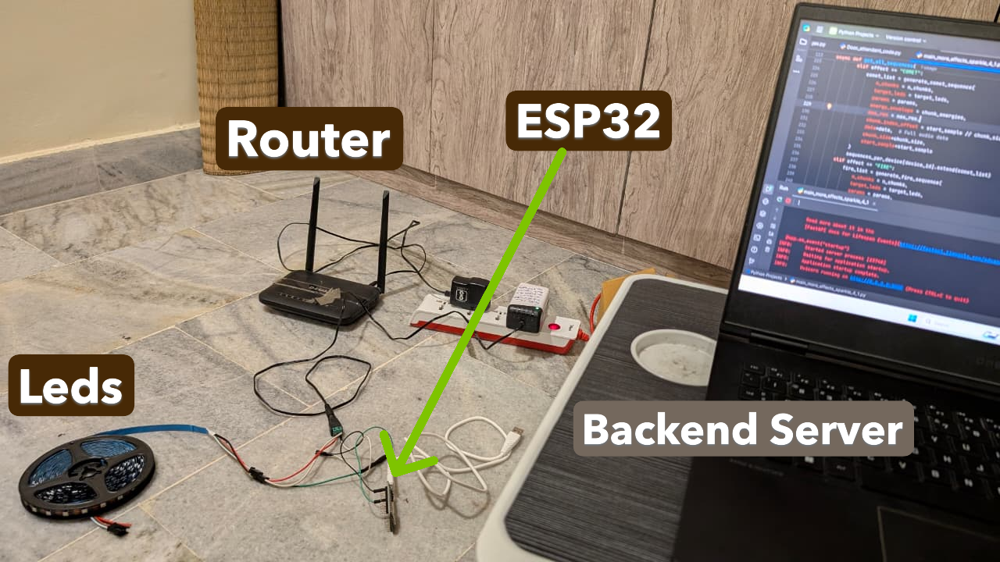

# 📢 Upcoming Documentation: Wearable-LED-Light-Show-Shirt

✨ I haven’t uploaded the full **Project Demo** for this one yet — because it’s something truly exciting!

For those reviewing my work from a **resume perspective**, I’ve uploaded a **demo video** showcasing the **LED-Music-Visualiser** in action.

---

## 👋 Dear Friends and Well-Wishers

I’ve been preparing detailed **README documentation** for my three projects.  
So far, I’ve completed the documentation for the **RC-Warship Project** 🚢.

---

## 📂 Project Release Plan (Next 2–3 Weeks)

1️⃣ **RC Warship** – ✅ Completed  
2️⃣ **LED Music Visualizer** – ✅ Completed  
3️⃣ **Wearable LED Light Show Shirt** –  🔜 Coming soon 

---

## 🎯 Final Note

I truly believe these projects will **surprise the audience** — so I’ll keep the **big reveal** for the day I share it on **LinkedIn**.  

👉 Stay tuned! 🚀

# LED Shirt Editor

## 🎶 Why I Built the LED Shirt Editor

Watching light shows and LED performances, I always wondered:  
*Are the LEDs really “dancing” to the music, or is there someone behind the scenes carefully programming every moment?*  
That question stayed with me.

After building my own LED Music Visualizer, I realized that most existing solutions are either:

- **Too basic** – Simple, microphone-based sound-to-light systems that just flash with volume.  
- **Too rigid** – Pre-programmed shows with little room for creativity on the user’s side.

The goal wasn’t just technical — it was about **creative freedom**.  
I wanted to build a system where anyone — whether a performer, hobbyist, or artist — could make LEDs dance to music exactly the way they imagine.

That’s how the **LED Shirt Editor** was born. ✨

---

## 🛠️ What This Project Includes

This project is a **complete solution**, consisting of:

1. **Python FastAPI Backend** – Processes music and timeline data.  
2. **Frontend Webpage** – Lets you visually design light shows with an intuitive timeline editor.  
3. **ESP32 Clients** – Execute the commands on the wearable LED shirts in real-time.  

---

## 🎥 Demo

Here’s a quick look at the system in action:

---

## 🚀 What It Does

In short, it transforms LED performances from being **“automated and hidden”** into something **user-driven, programmable, and interactive**.  

Instead of hardcoding effects, you can directly interact with the **frontend timeline** to design LED light events — making the process as intuitive as editing a video.

---

## 🏗️ Architecture Behind It

The project follows a **client–server model**, where the **laptop (server)** does all the heavy processing (music analysis, timeline editing, effect generation) and the **ESP32 boards (clients)** only execute LED instructions.

---

### 🔹 Components

1. **Frontend Webpage (Timeline Editor)**  
   - Lets users import a song.  
   - Displays a waveform/timeline (with beat detection).  
   - Allows placing LED events (colors, brightness, effects) in sync with the song.  
   - Exports the design as a JSON blueprint.  

2. **Python Backend Server (FastAPI + WebSockets)**  
   - Handles uploaded audio (`.wav`) + LED timeline (`.json`).  
   - Analyzes music (frequency/amplitude) to make patterns.  
   - Generates LED configuration arrays for each time chunk.  
   - Streams real-time LED data to ESP32 clients while music plays.  

3. **ESP32 Clients (LED Drivers)**  
   - Connect to Wi-Fi and listen to the server.  
   - Receive per-frame LED color data via WebSockets.  
   - Directly control WS2812B LED strips without heavy computation.  

---

### 🔹 System Workflow (Step by Step)

#### **Step 1 → User → Frontend (Editor Page)**
- User uploads a `.wav` music file.  
- Configures LED timelines (color, brightness, effects, ESP32 target).  
- Timeline UI provides play/pause/zoom/snapping controls.  

#### **Step 2 → Backend (Python) → Frontend (Editor Page)**
- Backend performs music analysis (FFT, beat detection) after preview request.  
- Generates preview LED data arrays for synchronization.  
- User continues editing after previewing.  

#### **Step 3 → Frontend (Editor Page) ↔ Backend (Python)**
- Frontend sends project data (timeline JSON + audio file) to backend.  
- Backend validates and stores configuration.  

#### **Step 4 → Frontend (Editor Page) → Waiting Page**
- Once editing is done, frontend submits final project for processing.  
- User is shown a **Waiting Page** while backend prepares LED arrays.  

#### **Step 5 → Waiting Page → Show Play/Restart Page**
- When backend finishes pre-computation, frontend switches to **Play/Restart Page**.  
- User is notified that playback is ready.  

#### **Step 6 → User → Show Play/Restart Page**
- User triggers Play or Restart.  
- Frontend sends control command to backend.  

#### **Step 7 → Show Play/Restart Page → Backend (Python)**
- Backend synchronizes audio playback with LED configuration streaming.  
- Handles play, pause, restart, and sync logic.  
- Streams LED frame data in real-time to ESP32 clients.  

#### **Step 8 → Backend (Python) → ESP32 Clients**
- Backend pushes per-frame LED data (RGB + brightness) via WebSockets.  
- ESP32s immediately render LEDs as instructed.  
- Continues until song ends or user stops playback.  

---

### 🔹 Simplified Data Flow

1. User loads a song in the webpage and designs the LED timeline.  
2. The blueprint JSON is sent to the Python backend.  
3. Backend processes audio + blueprint → generates LED frames.  
4. During playback, backend streams LED frames to all ESP32 clients in sync with the music.  
5. ESP32s simply display the incoming LED data.  

---

### 🔹 Why This Architecture?

- Keeps **ESP32 code lightweight** (only display logic).  
- Heavy tasks (audio analysis, timeline rendering, JSON parsing) stay on the **laptop**.  
- **Modular design** → Add more ESP32 devices without changing the core system.  
- **WebSockets** ensure real-time synchronization across devices.  

