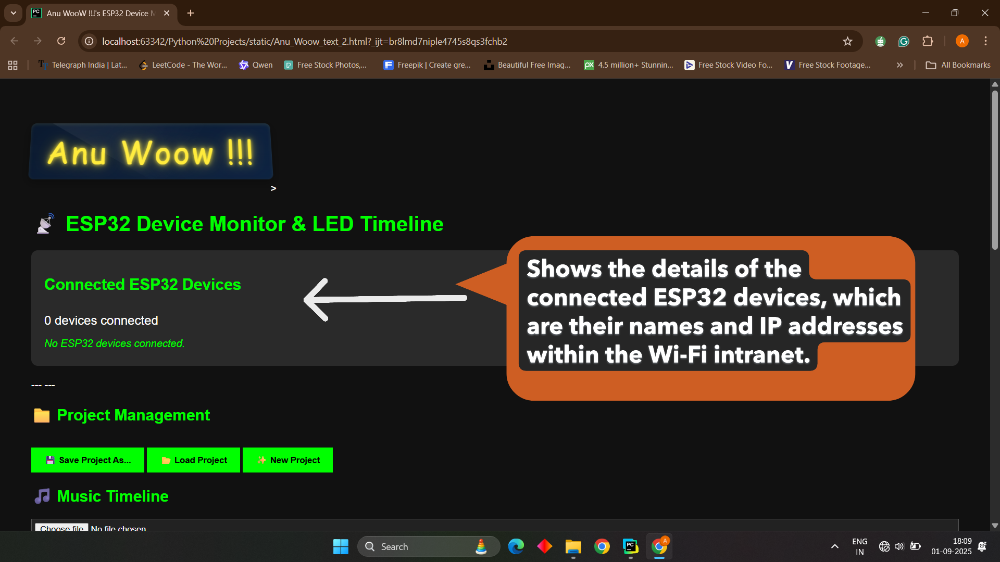
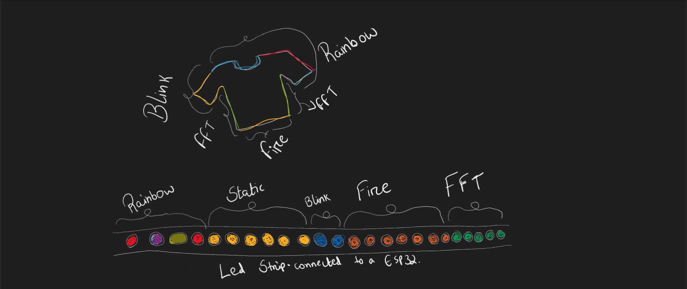

# 📢 Upcoming Documentation: Wearable-LED-Light-Show-Shirt

✨ I haven’t uploaded the full **Project Demo** for this one yet — because it’s something truly exciting!

For those reviewing my work from a **resume perspective**, I’ve uploaded a **demo video** showcasing the **LED-Music-Visualiser** in action.

---

## 👋 Dear Friends and Well-Wishers

I’ve been preparing detailed **README documentation** for my three projects.  
So far, I’ve completed the documentation for the **RC-Warship Project** 🚢.

---

## 📂 Project Release Plan (Next 2–3 Weeks)

1️⃣ **RC Warship** – ✅ Completed  
2️⃣ **LED Music Visualizer** – ✅ Completed  
3️⃣ **Wearable LED Light Show Shirt** –  🔜 Coming soon 

---

## 🎯 Final Note

I truly believe these projects will **surprise the audience** — so I’ll keep the **big reveal** for the day I share it on **LinkedIn**.  

👉 Stay tuned! 🚀

# LED Shirt Editor

## 🎶 Why I Built the LED Shirt Editor

Watching light shows and LED performances, I always wondered:  
*Are the LEDs really “dancing” to the music, or is there someone behind the scenes carefully programming every moment?*  
That question stayed with me.

After building my own LED Music Visualizer, I realized that most existing solutions are either:

- **Too basic** – Simple, microphone-based sound-to-light systems that just flash with volume.  
- **Too rigid** – Pre-programmed shows with little room for creativity on the user’s side.

The goal wasn’t just technical — it was about **creative freedom**.  
I wanted to build a system where anyone — whether a performer, hobbyist, or artist — could make LEDs dance to music exactly the way they imagine.

That’s how the **LED Shirt Editor** was born. ✨

---

## 🛠️ What This Project Includes

This project is a **complete solution**, consisting of:

1. **Python FastAPI Backend** – Processes music and timeline data.  
2. **Frontend Webpage** – Lets you visually design light shows with an intuitive timeline editor.  
3. **ESP32 Clients** – Execute the commands on the wearable LED shirts in real-time.  

---

## 🎥 Demo

Here’s a quick look at the system in action:

---

## 🚀 What It Does

In short, it transforms LED performances from being **“automated and hidden”** into something **user-driven, programmable, and interactive**.  

Instead of hardcoding effects, you can directly interact with the **frontend timeline** to design LED light events — making the process as intuitive as editing a video.

---

## 🏗️ Architecture Behind It

The project follows a **client–server model**, where the **laptop (server)** does all the heavy processing (music analysis, timeline editing, effect generation) and the **ESP32 boards (clients)** only execute LED instructions.

---

### 🔹 Components

1. **Frontend Webpage (Timeline Editor)**  
   - Lets users import a song.  
   - Displays a waveform/timeline (with beat detection).  
   - Allows placing LED events (colors, brightness, effects) in sync with the song.  
   - Exports the design as a JSON blueprint.  

2. **Python Backend Server (FastAPI + WebSockets)**  
   - Handles uploaded audio (`.wav`) + LED timeline (`.json`).  
   - Analyzes music (frequency/amplitude) to make patterns.  
   - Generates LED configuration arrays for each time chunk.  
   - Streams real-time LED data to ESP32 clients while music plays.  

3. **ESP32 Clients (LED Drivers)**  
   - Connect to Wi-Fi and listen to the server.  
   - Receive per-frame LED color data via WebSockets.  
   - Directly control WS2812B LED strips without heavy computation.  

---

### 🔹 System Workflow (Step by Step)

#### **Step 1 → User → Frontend (Editor Page)**
- User uploads a `.wav` music file.  
- Configures LED timelines (color, brightness, effects, ESP32 target).  
- Timeline UI provides play/pause/zoom/snapping controls.  

#### **Step 2 → Backend (Python) → Frontend (Editor Page)**
- Backend performs music analysis (FFT, beat detection) after preview request.  
- Generates preview LED data arrays for synchronization.  
- User continues editing after previewing.  

#### **Step 3 → Frontend (Editor Page) ↔ Backend (Python)**
- Frontend sends project data (timeline JSON + audio file) to backend.  
- Backend validates and stores configuration.  

#### **Step 4 → Frontend (Editor Page) → Waiting Page**
- Once editing is done, frontend submits final project for processing.  
- User is shown a **Waiting Page** while backend prepares LED arrays.  

#### **Step 5 → Waiting Page → Show Play/Restart Page**
- When backend finishes pre-computation, frontend switches to **Play/Restart Page**.  
- User is notified that playback is ready.  

#### **Step 6 → User → Show Play/Restart Page**
- User triggers Play or Restart.  
- Frontend sends control command to backend.  

#### **Step 7 → Show Play/Restart Page → Backend (Python)**
- Backend synchronizes audio playback with LED configuration streaming.  
- Handles play, pause, restart, and sync logic.  
- Streams LED frame data in real-time to ESP32 clients.  

#### **Step 8 → Backend (Python) → ESP32 Clients**
- Backend pushes per-frame LED data (RGB + brightness) via WebSockets.  
- ESP32s immediately render LEDs as instructed.  
- Continues until song ends or user stops playback.  

---

### 🔹 Simplified Data Flow

1. User loads a song in the webpage and designs the LED timeline.  
2. The blueprint JSON is sent to the Python backend.  
3. Backend processes audio + blueprint → generates LED frames.  
4. During playback, backend streams LED frames to all ESP32 clients in sync with the music.  
5. ESP32s simply display the incoming LED data.  

---

### 🔹 Why This Architecture?

- Keeps **ESP32 code lightweight** (only display logic).  
- Heavy tasks (audio analysis, timeline rendering, JSON parsing) stay on the **laptop**.  
- **Modular design** → Add more ESP32 devices without changing the core system.  
- **WebSockets** ensure real-time synchronization across devices.  

## 🌐 A Closer Look at the Frontend Webpage

### 🖋️ Signature Header & Device Monitor

- **"Anu Woow !!!" (Animated Title)**  
  A decorative, glowing text at the top that acts as a brand and personal signature for the editor.  
  

- **Connected ESP32 Devices List**  
  Displays the ID and IP address of each connected ESP32 client.  
  Updates in real-time via WebSockets so you can instantly see which devices are active and available for programming and previewing.  
  

---

### 📁 Project Management Controls

- **Save Project As…** → Saves the current timeline as a JSON file for later editing.  
- **Load Project** → Imports a previously saved project back into the editor.  
- **New Project** → Clears everything to start with a blank timeline.  

---

### 🎵 Music Timeline & Playback

- **File Upload (WAV only)** → The first step in creating a project is importing a WAV audio file.  
- **Waveform Display** → Powered by *WaveSurfer.js*, gives a precise view of the music for aligning markers.  
- **Playback Controls** → Play/Pause button with a Current Time / Total Duration display for precise editing.  

  

- **Export Timeline** → Uploads the entire timeline and audio to the backend server to begin the processing stage.  

| Export Timeline (PNG) | Export Timeline Demo (GIF) |
|------------------------|----------------------------|
|  |   |

### ➕ Adding a New LED Marker

The core creative tool for defining lighting events on the timeline.  
After filling out the form, click **Add Marker** to place the effect.

  

---
## 🎥 Demo

---
- **Timeline Settings** → Define the *Start Time* and *Duration* of the effect.  
- **Device & LED Range** → Select the *Target ESP32 ID* and LED range (e.g., `0,99` for the first 100 LEDs). Recent selections are saved to reduce typing.  
- **Effect & Parameters** → Choose an effect (Static, FFT, Blink, Rainbow, Chase, Sparkle, Strobe, Comet, Fire).  
  - Dynamic input fields appear to fine-tune parameters like color, speed, or density.  

---

### 🔍 Timeline Overview & Editing

- **LED Timeline Markers List**  
  Scrollable list displaying all added markers.  
  Each marker shows key details and includes a **Delete Button** for easy removal.  

  

- **Filters**  
  Manage large projects by filtering markers by ESP32 device or by time range.  
  

- **Preview Section**  
  Test a small segment of the music by entering a *Start Time* and *End Time*.  
  The Preview Button sends only that section to the backend for quick test playback.  

---

## 🖥️ A Deep Dive into the Backend Python Server

The backend server is the **brain** of the LED Shirt Editor system.  
Written in **Python with FastAPI**, it handles all heavy-lifting tasks that the lightweight ESP32 clients can’t.

**Core Responsibilities:**
- Handling audio and timeline uploads from the frontend.  
- Analyzing music (FFT, energy, Zero Crossing Rate, etc.) and generating LED effect sequences.  
- Managing real-time communication with ESP32 LED clients via WebSockets.  
- Synchronizing music playback with LED data streaming so lights stay perfectly in time with the audio.  

# ⚙️ Architecture

The server has four main responsibilities:

1. **Project Upload and Processing**  
   - Users upload a `.wav` file and an LED timeline configuration from the frontend.  
   - The server saves the files, analyzes the audio in chunks, and generates JSON sequences that describe the LED effects.  

2. **Effect Generation**  
   - Each supported effect (**STATIC, BLINK, SPARKLE, COMET, RAINBOW, CHASE, STROBE, FIRE, FFT**) has its own sequence generator function.  
   - These functions transform music features (energy, frequency, zero-crossing rate) into a series of LED control instructions.  
   - For example:  
     - **FFT**: Maps bass/mid/treble energy into RGB values.  
     - **SPARKLE**: Creates random LED fades, with intensity based on music energy and zero-crossing rate.  
     - **COMET**: Generates moving light trails, with the number and size determined by music speed.  

3. **Playback and Preview**  
   - **Full Playback (`/start-playback`)**: Plays the entire audio file while streaming the full LED data sequence.  
   - **Preview Mode (`/start-preview`)**: Trims a specific section of the audio and timeline for quick testing.  

4. **ESP32 Communication**  
   - ESP32 clients connect via the `/ws/esp32` endpoint, each identified by a unique `device_id`.  
   - The server sends per-chunk LED instructions as JSON packets via WebSockets during playback.  
   - Dashboards (frontends) can also connect to a separate `/ws/dashboard` endpoint to monitor connected ESP32 devices in real time.  
   - A heartbeat system automatically removes disconnected ESP32s from the active list.  

---

## 🔌 Key Code Components

- **FastAPI + WebSockets**: The core frameworks for building the API and handling real-time LED streaming.  
- **ConnectionManager**: A class that tracks all connected ESP32 devices and dashboards and manages broadcasting updates.  
- **`get_all_sequences()`**: A central function that generates all the LED sequences based on the uploaded audio and timeline.  
- **Effect Generators**: A collection of functions like `generate_fft_sequence` and `generate_sparkle_sequence` that produce the specific effect data.  
- **Audio Streaming (sounddevice)**: The library used to play audio on the server while sending the LED data in sync.  

---

## 📂 Files and Outputs

- **Uploaded Audio**: Saved as `uploaded_audio/uploaded.wav`.  
- **Timeline Config**: Saved as `led_timeline.json`.  
- **Precomputed Sequences**: Saved as `all_sequences.json`.  
- **ESP32 Commands**: Sent live as WebSocket JSON messages.   

---

# ⚡ A Deep Dive into the ESP32 Client

The ESP32 is a low-power microcontroller with built-in Wi-Fi, making it the perfect choice for this project. Its primary job is to act as a lightweight LED executor that smoothly displays the effects defined in the editor.

---

## Role & Communication
The ESP32's role is simple: it does not perform heavy processing. Instead, it maintains a WebSocket connection to the Python server and listens for real-time LED instructions. The server streams per-frame LED data, and the ESP32 simply parses these packets and updates the LED strips immediately.

---

## Key Features
- **Non-blocking design**: The code is written using a `millis()`-based loop instead of blocking delays, ensuring the ESP32 can simultaneously handle multiple tasks, like managing the Wi-Fi connection and updating the LEDs.  
- **Configurable Effects**: Each effect (Static, Blink, Sparkle, Comet, etc.) is highly configurable. The ESP32 code can handle parameters for duration, color, brightness, and specific LED ranges, allowing for a wide range of creative expression.  
- **Smooth Transitions**: The system is designed to allow multiple effects to run simultaneously on different LED segments. The ESP32 can also smoothly transition between different effects on the same LED range as the music timeline progresses.  

---

## Packet Handling
Each JSON packet received from the Python backend defines a specific command for the ESP32. It includes a target LED range, color/brightness values, an effect type, and any effect-specific parameters (e.g., speed or fade). The ESP32's code decodes this information and immediately applies the effect.

---

## Scalability
The system is highly scalable. Because each ESP32 only processes its assigned LED ranges, you can add more devices simultaneously to the same Wi-Fi network without impacting performance. This makes it possible to create large, synchronized light shows across multiple wearable devices.

---

## Why ESP32?
The ESP32 was chosen over alternatives like Arduino or Raspberry Pi for several key reasons:
- **Built-in Wi-Fi**: Provides seamless WebSocket communication out of the box.  
- **Timing-sensitive control**: It's powerful enough to handle the precise timing required for WS2812B LED strips.  
- **Power and Cost**: It's a low-cost, low-power device that is powerful enough to run smooth animations.  

---

# 🛠 Problems and Challenges Faced in Each Section

While pursuing my B.Tech in Electronics and Communications, I entered this project with limited programming background. I had studied C in my first year and Java in the third semester, but I didn’t have deep knowledge of HTML, CSS, or JavaScript. Python was completely new to me—I actually learned it while working on this project itself.  

There were many challenges I faced across different stages:

- **Learning New Languages and Tools**: Since I wasn’t fully familiar with web technologies or Python, I often had to rely on trial-and-error. AI tools like ChatGPT and Gemini came to my rescue whenever I got stuck.  
- **Real-time Synchronization**: One of the biggest hurdles was syncing the LED timeline with the music in real-time. Initially, the LEDs weren’t lighting in sync with the beats at all, and fixing this required multiple iterations.  
- **Division of Processing**: Another challenge was designing the effects in such a way that most of the processing happened in the Python server, while the ESP32 clients only executed simple instructions. Getting this balance right was not easy.  
- **Webpage Design and User Interface**: I had to decide how the entire webpage should look and function—what buttons to include, how to take inputs from the user, and what to do with those inputs. Even deciding how to structure blocks on the webpage and how they should appear visually was a new experience for me.  
- **Bridging Hardware and Software**: Perhaps the most interesting challenge was venturing into the narrow strip that connects hardware with software. Figuring out how software inputs would actually control hardware outputs was a learning curve.  
- **System Architecture**: In the initial stages, I also had to design the overall architecture of the system—how different components (frontend, backend, and ESP32 clients) would communicate with each other. This required multiple revisions before I found a structure that worked reliably.  

---

# 🚀 How Powerful This System Is?

This system is designed with scalability and flexibility at its core.

- **Supports Multiple ESP32s**: It can connect to multiple ESP32 controllers — theoretically up to 100 at once — each driving its own LED strip. This makes it possible to distribute LED strips across different wearable parts, such as a shirt, trousers, a hat, or even props and stage elements.  
- **Per-LED Control**: Every single LED can be programmed individually. This means you are not limited to broad effects; you can decide exactly how each LED should behave at every moment in the timeline. From subtle fades to synchronized chases, the level of detail is entirely in your hands.  
- **Modular Architecture**: The system’s architecture has been built in a modular way, so new effects can be added with ease. If you imagine a new lighting effect tomorrow, you don’t need to rebuild the system — you can simply extend the codebase and start using it.  
- **Creative Freedom**: Combined, these features give you the power to design anything from simple glowing patterns to complex, professional-grade light shows. Whether it’s for wearable fashion, stage performances, or synchronized room-scale shows, this system provides both fine-grained control and large-scale coordination.  

